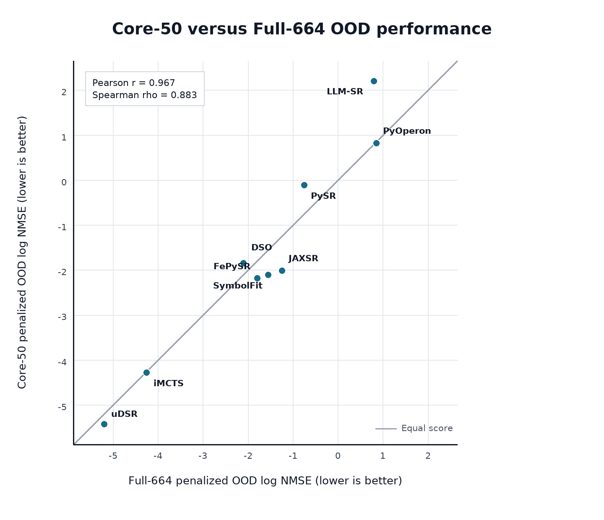

# Core-50 vs Full-664 OOD comparison: 9 algorithms

## Direct answer

Yes: Core-50 closely tracks Full-664 for the leaderboard's primary numerical
metric. This is a matched-run comparison: for every method, the Core-50 score is
computed from the same completed Full-664 runs, restricted to the frozen 50
tasks. Thus, the two columns differ only in the task set being averaged.

| Algorithm | Full-664 OOD | Rank | Core-50 OOD | Rank | Rank shift |
|---|---:|---:|---:|---:|---:|
| uDSR | -5.196 | 1 | -5.431 | 1 | 0 |
| iMCTS | -4.252 | 2 | -4.284 | 2 | 0 |
| DSO | -2.095 | 3 | -1.848 | 6 | +3 |
| FePySR | -1.794 | 4 | -2.187 | 3 | -1 |
| SymbolFit | -1.547 | 5 | -2.114 | 4 | -1 |
| JAXSR | -1.244 | 6 | -2.016 | 5 | -1 |
| PySR | -0.751 | 7 | -0.115 | 7 | 0 |
| LLM-SR | 0.797 | 8 | 2.201 | 9 | +1 |
| PyOperon | 0.854 | 9 | 0.820 | 8 | -1 |

`OOD` means the penalized OOD `log10(NMSE)` used to rank the clean leaderboard;
lower is better. The top two methods stay first and second, PySR stays seventh,
and 32 of the 36 pairwise method orderings are preserved. The largest change is
DSO moving from rank 3 to rank 6; the methods originally ranked 3--6 remain the
same four-method block.

## Two statistics to report

- **Pearson `r=0.967`** measures whether the actual OOD score
  values move together (`p=0.0001543`).
- **Spearman `rho=0.883`** measures whether the method ordering is
  preserved (`p=0.003075`).

These are complementary rather than duplicate coefficients: Pearson compares
the continuous OOD values, while Spearman compares their ranks. As a secondary
check on the reviewer's ID/OOD aggregate score, Pearson is
`0.975` and Spearman is `0.867`.

The resulting claim is deliberately limited: Core-50 preserves the broad
Full-664 numerical performance structure, not every adjacent rank exactly.

## Evidence boundary

- Probe-4 (`DSO`, `iMCTS`, `PyOperon`, `uDSR`) directly participated in the
  final construction panel.
- Probe-2 (`PySR`, `LLM-SR`) participated in earlier discovery and has only
  one seed (`1314`), while the other seven algorithms use seeds
  `520, 521, 522`.
- Only `FePySR`, `JAXSR`, and `SymbolFit` are post-submission held-out
  algorithms. Therefore the nine-algorithm result is an expanded
  representativeness check, not a fully independent nine-algorithm validation.
- The three held-out methods keep the same internal OOD order on both task sets,
  but `n=3` is too small to use that fact as a standalone significance claim.

## Paste-ready response

> We agree that MAE alone does not directly establish representativeness. We
> therefore compared Core-50 with Full-664 using the same completed runs and the
> leaderboard's primary metric, seed-median penalized OOD log-NMSE (lower is
> better). Across nine methods, the continuous OOD scores have Pearson
> `r=0.967` (`p=0.0001543`) and the method ranks have
> Spearman `rho=0.883` (`p=0.003075`);
> `32/36` pairwise orderings are preserved.
> Concretely, the Full-664 order is uDSR, iMCTS, DSO, FePySR, SymbolFit, JAXSR, PySR, LLM-SR, PyOperon, while the Core-50 order is
> uDSR, iMCTS, FePySR, SymbolFit, JAXSR, DSO, PySR, PyOperon, LLM-SR. For the ID/OOD aggregate score mentioned in the review, Pearson
> is `0.975` and Spearman is
> `0.867`. These results support the narrower claim that
> Core-50 preserves broad Full-664 numerical conclusions, rather than every
> adjacent rank exactly.
