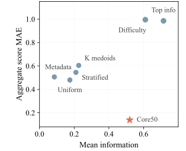
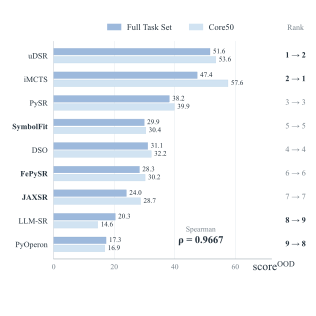
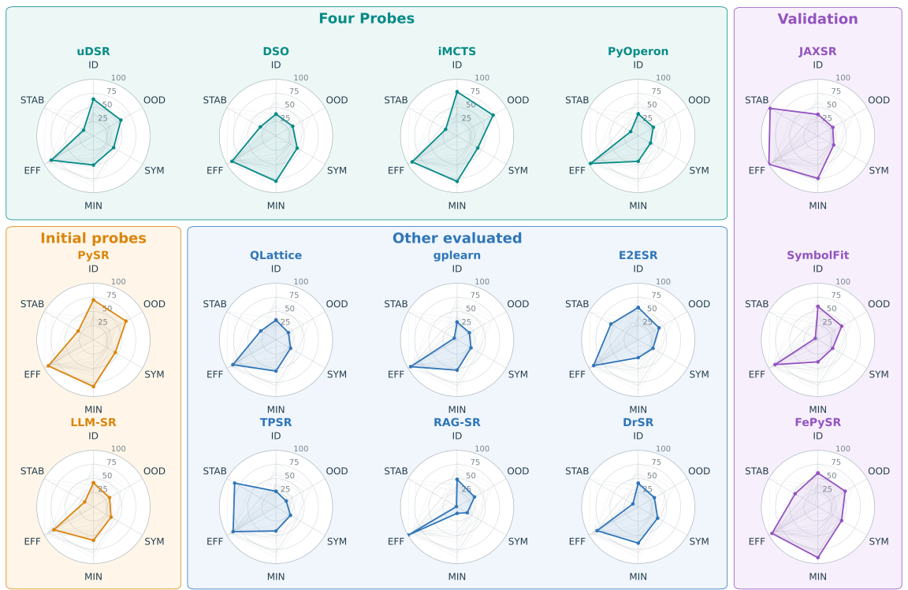

# SymbolicArena

[Paper: arXiv:2609.35113](https://arxiv.org/abs/2609.35113) · [Interactive demo](http://symbolicarena.top/) · [License](./LICENSE)

SymbolicArena is a benchmark and evaluation toolkit for symbolic regression. It standardizes heterogeneous datasets, runs algorithms through a common Python interface and execution protocol, and records both final expressions and search trajectories. The repository contains the execution code, example datasets, experiment records, and the static demo in [`docs/`](./docs/).

## From 664 tasks to Core50

The paper standardizes 664 executable symbolic regression tasks and selects 50 tasks for Core50. The selection considers task coverage, algorithm responses, and distributional balance; the smaller benchmark reduces the evaluation workload by **92.5%**.


*Figure 1. The benchmark distillation and evaluation workflow.*

In the paper's comparison against six other 50-task selectors, Core50 obtains the lowest aggregate score mean absolute error to the full task set (**0.1388**), reducing this error by **72.6%–86.7%**. Across the nine algorithms evaluated on both scales, Spearman rank correlation is **0.9833 for ID** and **0.9667 for OOD**. These fidelity results use the paper's separate one-hour evaluation records.



*Figure 2b. Mean task information and aggregate score error for Core50 and six alternative selectors.*



*Figure 3b. OOD agreement between Core50 and the full task set; three validation algorithms were excluded from benchmark construction.*

## What the six evaluation axes reveal

The formal evaluation compares **15 algorithms** on Core50 with a three-hour budget and three random seeds. ID and OOD measure numerical quality; SYM and MIN measure symbolic fidelity and expression minimality; EFF and STAB describe search progress and consistency across seeds. The paper reports that no evaluated method leads on every axis. Strong numerical fitting can coexist with limited symbolic recovery, while repeatable or rapid progress alone does not establish high final quality.



*Figure 4. Clean-condition scores on the six axes, displayed on a 0–100 scale.*

Figures are reproduced from [SymbolicArena (arXiv:2609.35113v1)](https://arxiv.org/abs/2609.35113v1), licensed under [CC BY 4.0](https://creativecommons.org/licenses/by/4.0/). The findings above describe the paper's reported experiments and their evaluated task distribution and configurations.

## Repository structure

- [`scientific_intelligent_modelling/algorithms/`](./scientific_intelligent_modelling/algorithms/): algorithm wrappers and bundled upstream sources.
- [`scientific_intelligent_modelling/benchmarks/`](./scientific_intelligent_modelling/benchmarks/): shared benchmark runner, metrics, and result processing.
- [`scientific_intelligent_modelling/srkit/`](./scientific_intelligent_modelling/srkit/): `SymbolicRegressor`, subprocess execution, and Conda environment management.
- [`scientific_intelligent_modelling/config/`](./scientific_intelligent_modelling/config/): case-sensitive algorithm IDs, environment specifications, and evaluation settings.
- [`scientific_intelligent_modelling/cli.py`](./scientific_intelligent_modelling/cli.py): the `sim-cli` command-line entry point.
- [`examples/`](./examples/): small, complete example datasets with training, validation, ID, and OOD splits.
- [`A_ICLR_experiments/`](./A_ICLR_experiments/), [`AAAI_experiments/`](./AAAI_experiments/), [`A_Neurips_experiments/`](./A_Neurips_experiments/): recorded experiment and benchmark preparation artifacts.
- [`docs/`](./docs/): GitHub Pages source, paper figures, and published aggregate results. The browser fetches individual preprocessed trajectories from OSS as needed.
- [`tools/`](./tools/): figure export and static data publication scripts.
- [`tests/`](./tests/): automated checks; [`sim-datasets-py/`](./sim-datasets-py/) is a separate dataset Python package submodule.

Registered algorithm IDs include `dgp`, `gplearn`, `pysr`, `pyoperon`, `fepysr`, `jaxsr`, `symbolfit`, `dso`, `udsr`, `llmsr`, `drsr`, `tpsr`, `e2esr`, `ragsr`, `QLattice`, and `iMCTS`. Names are case-sensitive; the authoritative registry is [`toolbox_config.json`](./scientific_intelligent_modelling/config/toolbox_config.json).

## Installation

Install Git and Conda on Linux or macOS. The main environment uses Python 3.10; algorithms may require separate environments and additional model weights or API access. See [`envs_config.json`](./scientific_intelligent_modelling/config/envs_config.json) for their dependencies.

```bash
git clone https://github.com/scientific-intelligent-modelling/SymbolicArena.git
cd SymbolicArena
conda env create -f environment.yml
conda activate sim
python -m pip install -e .
sim-cli --help
```

To use the separate dataset Python package, initialize its submodule with `git submodule update --init --recursive -- sim-datasets-py`. The small datasets under [`examples/`](./examples/) are already in this repository. The full task data are distributed separately and are not included in the Git checkout. When an algorithm environment is missing, the toolkit attempts to create the environment specified for that algorithm in `envs_config.json`.

## Quick start

### Python API

This example uses `gplearn` (provided by the `sim_base` algorithm environment):

```python
import numpy as np

from scientific_intelligent_modelling.srkit.regressor import SymbolicRegressor

rng = np.random.RandomState(0)
X = rng.rand(100, 2)
y = X[:, 0] ** 2 + X[:, 1] + 0.01 * rng.randn(100)

regressor = SymbolicRegressor(
    "gplearn",
    problem_name="quickstart",
    seed=42,
    population_size=500,
    generations=10,
)
regressor.fit(X, y)

print("Best equation:", regressor.get_optimal_equation())
print("First candidates:", regressor.get_total_equations()[:3])
print("Predictions:", regressor.predict(X[:5]))
```

`SymbolicRegressor(..., **kwargs)` passes algorithm options to the registered wrapper. Each wrapper has its own dependencies and parameter names; consult its code and `envs_config.json` before changing algorithms.

### Run a single CSV file

By default, the CLI expects a CSV header and uses the last column as the target:

```bash
sim-cli \
  --algorithm gplearn \
  --train-path examples/BPG0/train.csv \
  --dataset-name demo \
  --seed 42 \
  --population-size 500 \
  --generations 10
```

Additional `--key value` or `--key=value` options are converted to Python names (`--population-size` becomes `population_size`) and passed to the wrapper. The loader also accepts NumPy `.npy` arrays and `.npz` files containing `arr_0`.

### Run a benchmark dataset

Each example dataset under `examples/` contains `metadata.yaml`, `train.csv`, `valid.csv`, `id_test.csv`, and `ood_test.csv`. Point `--train-path` at the **directory** to run the shared benchmark protocol:

```bash
sim-cli \
  --algorithm gplearn \
  --train-path examples/BPG0 \
  --seed 42 \
  --timeout-in-seconds 600 \
  --output-root bench_results/quickstart
```

The runner reads feature and target names from `metadata.yaml` and writes its results below `--output-root`. The default output directory is `bench_results/sim_cli/`. Direct Python API runs create `experiments/<problem>_<algorithm>_seed<seed>_<timestamp>/`.

### Explore the published trajectories

The [interactive demo](http://symbolicarena.top/) lets you select an algorithm, Core50 dataset, training noise level (clean, 1%, or 5%), and seed. Its timeline covers 180 minutes and updates the expression, fitted points, and ID/OOD curves. The aggregate six-axis chart uses the paper's published results; individual trajectories are fetched from a versioned OSS release. To serve the same site locally:

```bash
python -m http.server 8000 --directory docs
```

Open `http://localhost:8000/`. The local HTML still retrieves public trajectory data from OSS; it does not require a local copy of the complete experiment archive.

## Extending the toolkit

The [agent integration workflow](./docs/algorithm-integration.md) provides pinned source inspection, isolated environment setup, native prediction and recovery checks, minute-level budget checks, and acceptance on frozen Core50. Use the repository's `sr-tool-onboarder` skill with an author repository URL; the `sim-onboard` CLI produces source and acceptance reports. DGP is integrated through its pinned author source and the `SIM_DGP_SOURCE` environment variable.

To integrate an additional algorithm, implement the shared interface in a wrapper under [`algorithms/`](./scientific_intelligent_modelling/algorithms/), register its case-sensitive name and environment in [`toolbox_config.json`](./scientific_intelligent_modelling/config/toolbox_config.json) and [`envs_config.json`](./scientific_intelligent_modelling/config/envs_config.json), and verify training, prediction, expression output, and serialization with the actual dependency. Wrappers that receive `n_features`, `feature_names`, and `target_name` must check these values against the input at the start of `fit`. Record any bundled upstream source and license in [`VENDORED_SOURCES.md`](./scientific_intelligent_modelling/algorithms/VENDORED_SOURCES.md). Pass credentials through runtime environment variables.

## Troubleshooting

### The dataset Python package directory is empty

```bash
git submodule update --init --recursive -- sim-datasets-py
```

Algorithm sources are included in the main repository; only the dataset Python package is a submodule.

### The algorithm environment is unavailable

Run the environment manager from the repository root with the `sim` environment active, and create the Conda environment specified for the algorithm in `toolbox_config.json`:

```bash
python -m scientific_intelligent_modelling.srkit.conda_env_manager
```

### An algorithm requires model weights or API access

Follow that wrapper's bundled upstream instructions and its entry in `envs_config.json`. Supply API credentials at runtime; do not commit credentials.

### A dataset directory is loaded as a single file

Pass the directory itself to `--train-path`. The CLI recognizes a benchmark directory when both `metadata.yaml` and `train.csv` exist.

## Citation and license

If you use SymbolicArena in research, cite [Zhang et al., *SymbolicArena: A Unified Infrastructure for Benchmark Distillation and Dynamic Evaluation in Symbolic Regression* (2026)](https://arxiv.org/abs/2609.35113). The repository code is licensed under [GPL-3.0-or-later](./LICENSE); reproduced paper figures are attributed above under CC BY 4.0.
